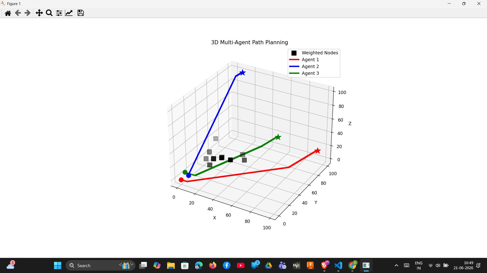
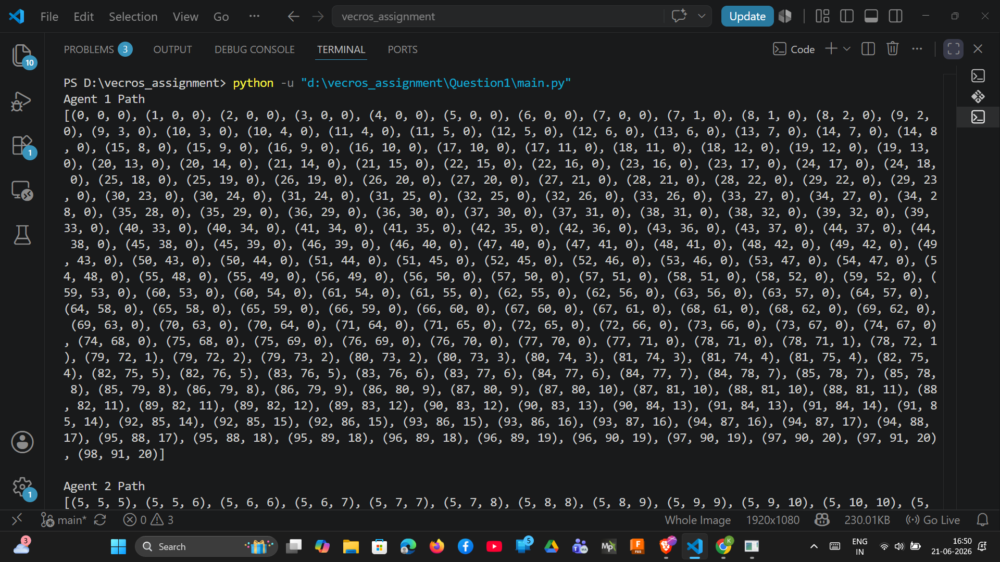
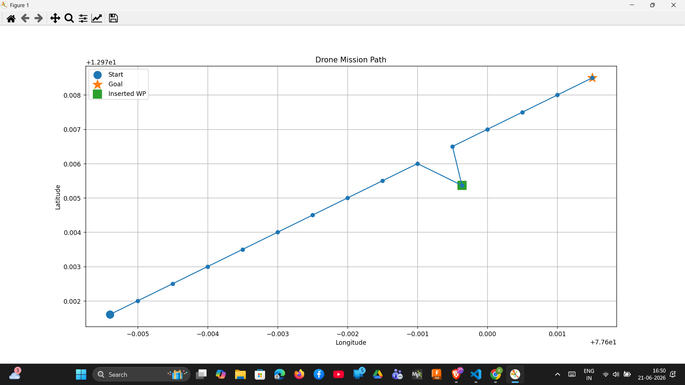
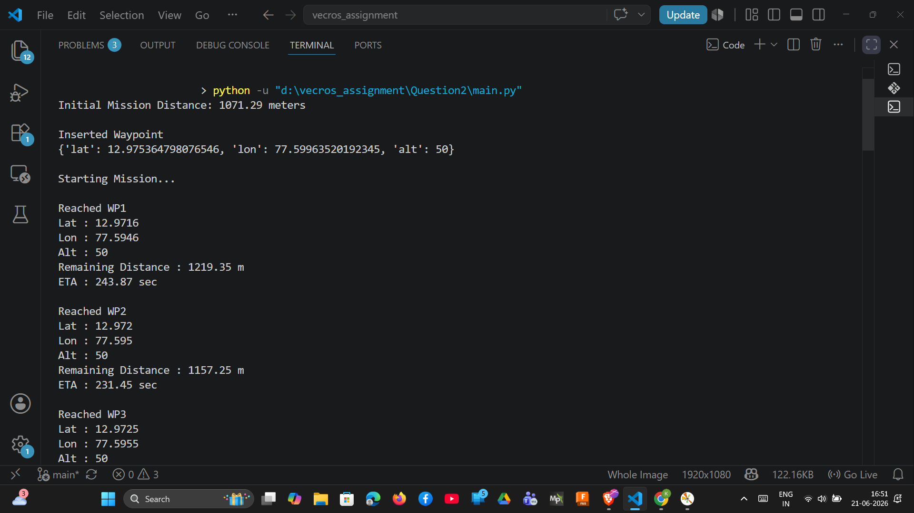

# Vecros Robotics Intern Assignment

<p align="center">
  
  
  
  
</p>

---

## 📌 Overview

This repository contains my solutions for the **Vecros Robotics Intern Assignment**, which consists of two robotics-focused problems:

1. **Multi-Agent 3D Path Planning**

   * Weighted A* Search
   * Multi-Agent Collision Avoidance
   * Space-Time Planning
   * 3D Visualization

2. **Autonomous Drone Mission Planning**

   * GPS Waypoint Navigation
   * Dynamic Waypoint Insertion
   * Distance and ETA Estimation
   * DroneKit and PyMAVLink Integration
   * 2D Mission Visualization

The project was implemented entirely in **Python** with a strong focus on algorithmic understanding, code readability, and visualization.

---

# 👨‍💻 Author

**Md Kashif Alam**

* GitHub: https://github.com/KashifAlam407
* LinkedIn: https://www.linkedin.com/in/md-kashif-alam-a55b19380/
* Portfolio: https://kashifalam407.github.io/Portfolio/

---

# 📂 Repository Structure

```text
Vecros_Robotics_Intern_Assignment/
│
├── README.md
├── requirements.txt
│
├── Question1/
│   ├── main.py
│   └── screenshots/
│
├── Question2/
│   ├── main.py
│   ├── dronekit_example.py
│   ├── pymavlink_example.py
│   └── screenshots/
│
└── results/
    ├── terminal1.png
    ├── result1.png
    ├── terminal2.png
    └── result2.png
```

---

# 🚀 Technologies Used

* Python 3.11
* NumPy
* Matplotlib
* Heapq
* DroneKit
* PyMAVLink

---

# Question 1 – Multi-Agent 3D Path Planning

## Problem Statement

* Create a 3D grid from:

```text
(0,0,0) → (100,100,100)
```

* Assign weighted nodes.
* Compute shortest paths for multiple agents.
* Ensure no two agents occupy the same node at the same time.
* Visualize paths in 3D.

---

# Approach

## Step 1 – Create 3D Grid

Each node is represented as:

```text
(x, y, z)
```

---

## Step 2 – Weighted Nodes

Certain nodes are assigned additional traversal costs:

```python
weights = {
    (26,17,30):10,
    (39,49,19):15,
    ...
}
```

---

## Step 3 – Weighted A* Search

Cost Function:

```text
f(n) = g(n) + h(n)
```

where,

```text
g(n)
=
movement_cost
+
weight_cost
```

and

```text
h(n)
=
Euclidean Distance to Goal
```

---

## Step 4 – Multi-Agent Planning

Each state is represented as:

```text
(x, y, z, t)
```

where:

```text
t = time
```

Collision avoidance is implemented using a:

### Reservation Table

```text
((x,y,z), time)
```

The planner follows a:

### Prioritized Planning Strategy

```text
Agent 1
   ↓
Reserve states
   ↓
Agent 2
   ↓
Reserve states
   ↓
Agent 3
```

---

# Algorithms Used

* Weighted A*
* Euclidean Heuristic
* Reservation Table
* Space-Time Planning
* Prioritized Multi-Agent Planning

---

# Results

## 3D Multi-Agent Path Planning

> Add image after uploading.

```markdown

```


---

## Terminal Output

```markdown

```


---

# Question 2 – Autonomous Drone Mission Planning

## Problem Statement

* Create 15 GPS waypoints.
* Execute mission in AUTO mode.
* Insert a new waypoint after waypoint 10.
* New waypoint must be 100m perpendicular to the current direction of travel.
* Compute remaining distance and ETA.
* Plot mission path in 2D.

---

# Approach

## Step 1

Create GPS waypoints:

```python
{
    'lat': value,
    'lon': value,
    'alt': value
}
```

---

## Step 2

Compute distances using the:

### Haversine Formula

---

## Step 3

Simulate AUTO mission execution.

---

## Step 4

Generate a perpendicular waypoint.

Direction Vector:

```text
(dx, dy)
```

Perpendicular Vector:

```text
(-dy, dx)
```

---

## Step 5

Insert new waypoint and continue mission.

---

## Step 6

Continuously compute:

* Remaining Distance
* Estimated Time of Arrival (ETA)

---

# Algorithms Used

* Haversine Distance
* Vector Geometry
* Dynamic Mission Update
* ETA Estimation

---

# DroneKit & PyMAVLink Integration - (I had not integrated this file yet because I didn't have access to a Pixhawk or ArduPilot SITL environment during the assignment)

This repository also includes example implementations demonstrating how the same mission can be uploaded to a Pixhawk flight controller using:

* DroneKit
* MAVLink Mission Commands
* AUTO Mission Mode

The mission can be executed either:

* On a real Pixhawk
* Using ArduPilot SITL

---

# Results

## Mission Path

```markdown

```


---

## Terminal Output

```markdown

```


---

# Installation

Clone repository:

```bash
git clone https://github.com/KashifAlam407/Vecros_Robotics_Intern_Assignment.git

cd Vecros_Robotics_Intern_Assignment
```

Install dependencies:

```bash
pip install -r requirements.txt
```

---

# Run

### Question 1

```bash
python Question1/main.py
```

### Question 2

```bash
python Question2/main.py
```

---

# Future Improvements

* CBS (Conflict-Based Search) for multi-agent planning.
* Dynamic obstacles in 3D environment.
* Real-time visualization.
* Integration with Gazebo and ROS2.
* Real drone mission execution through MAVLink.
* Mission monitoring using telemetry feedback.

---

# Acknowledgements

This project was completed as part of the **Vecros Robotics Internship Assignment** and focuses on practical applications of:

* Path Planning
* Multi-Agent Systems
* Autonomous Navigation
* Drone Mission Planning
* MAVLink Ecosystem

---

## Thank You

I appreciate your time in reviewing this submission.

**Md Kashif Alam**
